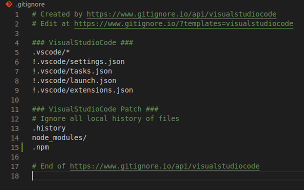
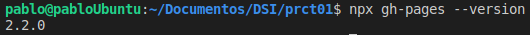
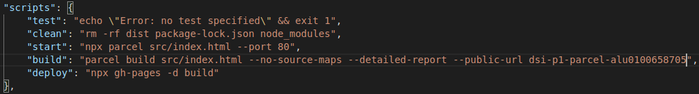
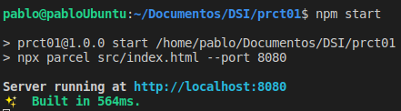
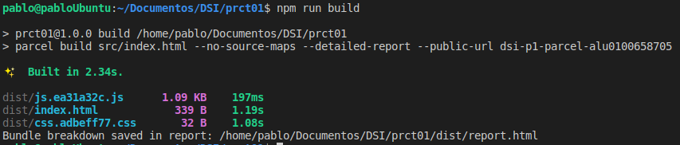
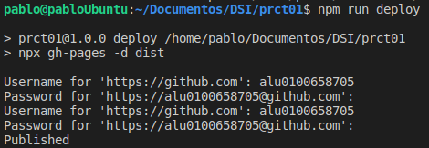
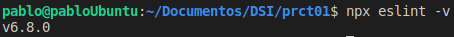
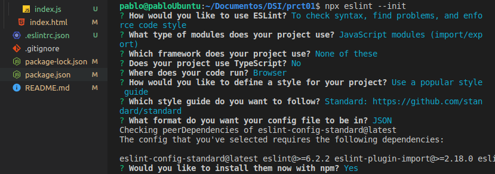
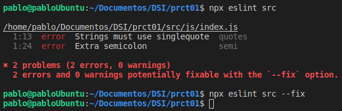
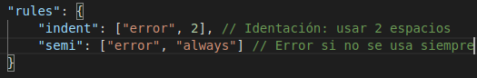

## dsi-p1-parcel-alu0100658705

## Pablo Bethencourt Díaz

## alu0100658705@ull.edu.es

### Práctica 1. Parcel

1. **Entorno de desarollo con una correcta estructura de carpetas**

Trás instalar las distintas herramientas, vemos como queda configurado el proyecto con la siguiente jerarquía de carpetas:

2. **Uso correcto de <code>Git</code> y de <code>NPM</code>**

- **Versión NodeJS:**

- **Configuración fichero .gitignore, se ha hecho uso de la aplicación _gitignore.io_ para generar la base del archivo:**

- **Instalación del paquete "gh-pages" con <code>npm install -D gh-pages</code>**
  

3. **Instala Parcel y utilizalo como automatizador.**
   Para la instalación de **ParcelJS** se ha seleccionado la opción de instalar como proyecto, es decir, se ha realizado mediante el comando <code>npm install -D parcel-bundler</code>, puesto que la instalación global ha dado problemas. Conprobamos la versión instalada, seleccionamos el fichero de entrada y comprobamos que el servicio se inicia correctamente:

   

   - **¿Debes instalarlo como paquete global o como paquete de proyecto?**
     La instalación global resulta más práctica cuando se quiere utilizar **Parcel** en diferentes repositorios sin tener que volver a instalarlo nuevamente para cada proyecto. No obstante, esto no implica necesariamente que se deba instalar de forma global obligatoriamente, la opción de instalación de proyecto presenta la ventaja de que, cuando se realize el _npm install_, automaticamente se instalarán todos los paquetes y dependencias, sin necesidad de tener que cerciorarnos de que el paquete se encuentra instalado previamente en la máquina.
     En este caso además, la instalación global ha dado problemas, por lo que para esta práctica se ha utilizado la opción proyecto en vista de solucionar el problema para las prácticas siguientes.

   - **¿Si lo instalasemos como paquete de proyecto que debemos tener en cuenta?**
     Tendremos que tener en cuenta que, para nuevos proyectos, será necesario volver a instalar **Parcel**. También es importante considerar que cuando realizos <code>npm install</code> en una nueva máquina, tendremos ya el paquete disponible para su uso. Hay que usar _npx_ antes de ejecutar **Parcel**.

   - **Plugins para Parcel: Visualiser**
     Instalación con <code>npm install --save-dev parcel-plugin-bundle-visualiser</code> genera un fichero _report.html_ con los tamaños de las dependencias del proyecto.

4. **Scripts de NPM:**
   Se han añadido los siguientes scripts:

   

- **Se ha añadido la opción _star_ al scrip del proyecto que inicia el servicio:**

  

- **Se ha añadido la opción _build_ al script del proyecto que construye la aplicación**

  

- **Se ha añadido la opción _deploy_ que despliaga la aplicación en gh-pages, el comando se ha modificado puesto que daba un error que impedia el despliegue**:

  

5. **Instala y configura ESLint y Prettier para tu proyecto.**

- **ESLint**: Instalación con <code>npm install -D eslint</code> a nivel de proyecto:

  

- Configuración de los parámetros e instalación, vemos como se crea el fichero con extensión JSON:

  

- Uso de **ESLint** y correción de errores:

  

- Creación y modificación de reglas en el fichero _.eslintrc.json_:

  

  - **Prettier**: Instalación y configuración del paquete para evitar conslictos con **ESLint** mediante los comandos <code>npm install -D prettier</code> y <code>npm install -D eslint-config-prettier eslint-plugin-prettier</code>

### Retos

1. **Vinilo**

Implementación del vinilo:

2. **Assets con Parcel**

En función del recurso o _asset_ que se quiera importar, **Parcel** ofrece distintas opciones:

- **JavaScript**: Parcel soporta tanto CommonJS como módulos en ES6 para importar archivos. Alguna formas de importar esto archivos son las siguientes:

  - Para CommonJS: Se puede utilizar <code> const dep = require('./path/to/dep') </code>
  - Para importa un módulo utilizando ES6: <code> import dep from './path/to/dep' </code>

- **CSS**: Pueden ser importados a partir de un archivo JavaScript o HTML, y pueden tener referencias de dependencias utilizando _@import_ así también como referencias a imágenes, fuentes, etc, a través de la función url().

  - Para importar otro archivo css: <code>@import './other.css';</code>
  - Para hacer referncia a una imagen: <code>url('./images/background.png');</code>

- **HTML**: Los archivos HTML se suelen utilizar como punto de entrada para Parcel. Todos los nombres de archivos deben ser relativos al archivo HTML actual.

  - Ej: <code> <a href="./other.html">Enlace a otra página</a> </code>
