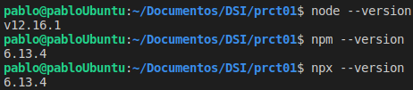
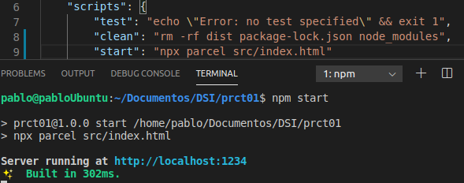
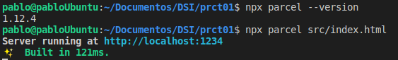

# dsi-p1-parcel-alu0100658705

## Pablo Bethencourt Díaz

## alu0100658705@ull.edu.es

### Versión NodeJS

### Configuración fichero .gitignore

3. **Instala Parcel y utilizalo como automatizador.**
   Para la instalación de **ParcelJS** se ha seleccionado la opción de instalar como proyecto, es decir, se ha realizado mediante el comando <code>npm install -D parcel-bundler</code>, puesto que la instalación global ha dado problemas. Conprobamos la versión instalada, seleccionamos el fichero de entrada y comprobamos que el servicio se inicia correctamente:

   

   - **¿Debes instalarlo como paquete global o como paquete de proyecto?**
     La instalación global resulta más práctica cuando se quiere utilizar **Parcel** en diferentes repositorios sin tener que volver a instalarlo nuevamente para cada proyecto. No obstante, esto no implica necesariamente que se deba instalar de forma global obligatoriamente, la opción de instalación de proyecto presenta la ventaja de que, cuando se realize el _npm install_, automaticamente se instalarán todos los paquetes y dependencias, sin necesidad de cerciorarnos de que el paquete se encuentra instalado previamente en la máquina.
     En este caso además, la instalación global ha dado problemas, por lo que para esta práctica se ha utilizado la opción proyecto, en vista de solucionar el problema para las prácticas siguientes.

   - **¿Si lo instalasemos como paquete de proyecto que debemos tener en cuenta?**
     Tendremos que tener en cuenta que, para nuevos proyectos, será necesario volver a instalar **Parcel**, también, cuando realizos <code>npm install</code> en una nueva máquina, tendremos ya el paquete disponible para su uso.
