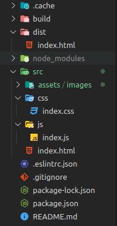

# dsi-p1-parcel-alu0100658705

## Pablo Bethencourt Díaz

## alu0100658705@ull.edu.es

### Versión NodeJS

##

1. **Entorno de desarollo con una correcta estructura de carpetas**
2. **Uso correcto de <code>Git</code> y de <code>NPM</code>**

- **Configuración fichero .gitignore**
- **Instalación del paquete "gh-pages" con <code>npm install -D gh-pages</code>**
  

3. **Instala Parcel y utilizalo como automatizador.**
   Para la instalación de **ParcelJS** se ha seleccionado la opción de instalar como proyecto, es decir, se ha realizado mediante el comando <code>npm install -D parcel-bundler</code>, puesto que la instalación global ha dado problemas. Conprobamos la versión instalada, seleccionamos el fichero de entrada y comprobamos que el servicio se inicia correctamente:

   

   - **¿Debes instalarlo como paquete global o como paquete de proyecto?**
     La instalación global resulta más práctica cuando se quiere utilizar **Parcel** en diferentes repositorios sin tener que volver a instalarlo nuevamente para cada proyecto. No obstante, esto no implica necesariamente que se deba instalar de forma global obligatoriamente, la opción de instalación de proyecto presenta la ventaja de que, cuando se realize el _npm install_, automaticamente se instalarán todos los paquetes y dependencias, sin necesidad de tener que cerciorarnos de que el paquete se encuentra instalado previamente en la máquina.
     En este caso además, la instalación global ha dado problemas, por lo que para esta práctica se ha utilizado la opción proyecto en vista de solucionar el problema para las prácticas siguientes.

   - **¿Si lo instalasemos como paquete de proyecto que debemos tener en cuenta?**
     Tendremos que tener en cuenta que, para nuevos proyectos, será necesario volver a instalar **Parcel**. También es importante considerar que cuando realizos <code>npm install</code> en una nueva máquina, tendremos ya el paquete disponible para su uso. Hay que usar _npx_ antes de ejecutar **Parcel**.

   - **Plugins para Parcel: Visualiser**
     Instalación con <code>npm install --save-dev parcel-plugin-bundle-visualiser</code> genera un fichero _report.html_ con los tamaños de las dependencias del proyecto.

4) **Scripts de NPM:**
   Se han añadido los siguientes scripts:

- **Se ha añadido la opción _star_ al scrip del proyecto:**

  

5. **Instala y configura ESLint y Prettier para tu proyecto.**

- **ESLint**: Instalación con <code>npm install -D eslint</code> a nivel de proyecto:

  

- Configuración de los parámetros e instalación, vemos como se crea el fichero con extensión JSON:

  

- Uso de **ESLint** y correción de errores:

  

- Creación y modificación de reglas en el fichero _.eslintrc.json_:

  

  - **Prettier**: Instalación y configuración del paquete para evitar conslictos con **ESLint** mediante los comandos <code>npm install -D prettier</code> y <code>npm install -D eslint-config-prettier eslint-plugin-prettier</code>

### Retos

1. **Vinilo**

2. **Assets con Parcel**
